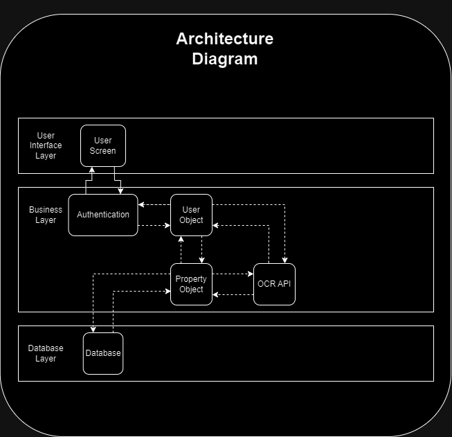

# Architecture

## Diagram:

## Explanations:

### User Screen
This is included because a UI is needed for the User to utilize the functionality of the app.

### Authentication
The User will need to authenticate themself before being able to use the app.

### User Object
An instance of the User class which owns many projects and properties. It allows the User to manage properties through the Property Object and its attached documents, and use the OCR API to scan new documents.

### OCR API
The OCR API will be responsible for scanning new documents and putting the text in a json file. The backend will then organize that data and attach it to the property.

### Property Object
The Property object is an instance of the Property class which includes the street address of the property as well as any other identifiers (number of bedrooms, bathrooms, etc.). It connects to the User Object and the OCR API to track who is uploading and attaching new documents to it.

### Database
This is where all the Properties and relevant documents are stored.

