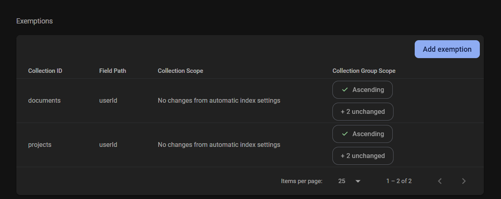

## Deploying

Deployment is handled by Firebase, which you must be invited to in order to manage relevant backend operations.

The following Firebase database single-field exemptions must be made in order for the app to work properly. You can generate these automatically after hooking it up with the proper Firebase API calls by simply entering the projects and documents pages in the app, and clicking the link that appears in the console alongside the fetch error. Screenshot is for reference:

Should you run into issues related to Firebase, you can troubleshoot errors by temporarily changing the database or storage rules in the Firebase panel, or by creating your own firebase project and connecting the project to it.
