# How to use the Placenet App (Iteration 4)

### Welcome Page
When you first access the app, you will see the welcome page where you will be prompted to sign into your existing account, or create an account by signing up.
1.  Click 'Sign Up'

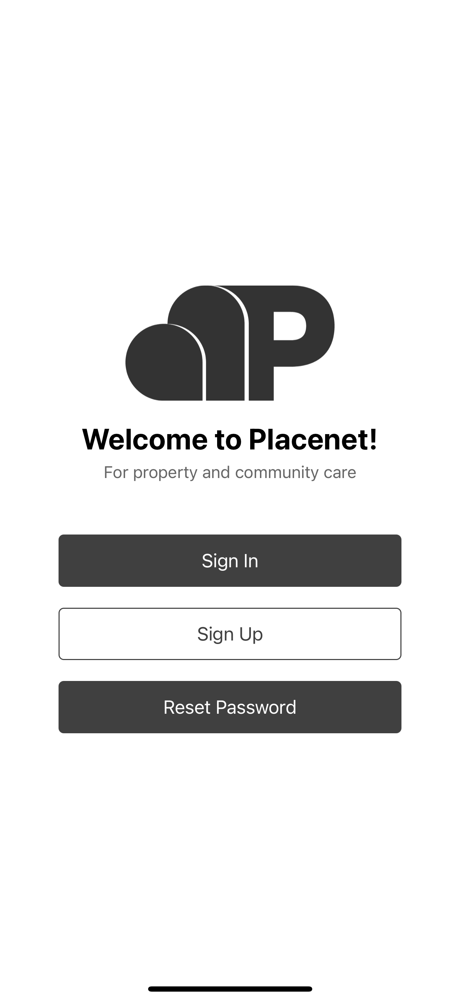

You can reset your password by pressing "Reset Password" and entering your email. Firebase will send an email for the reset.

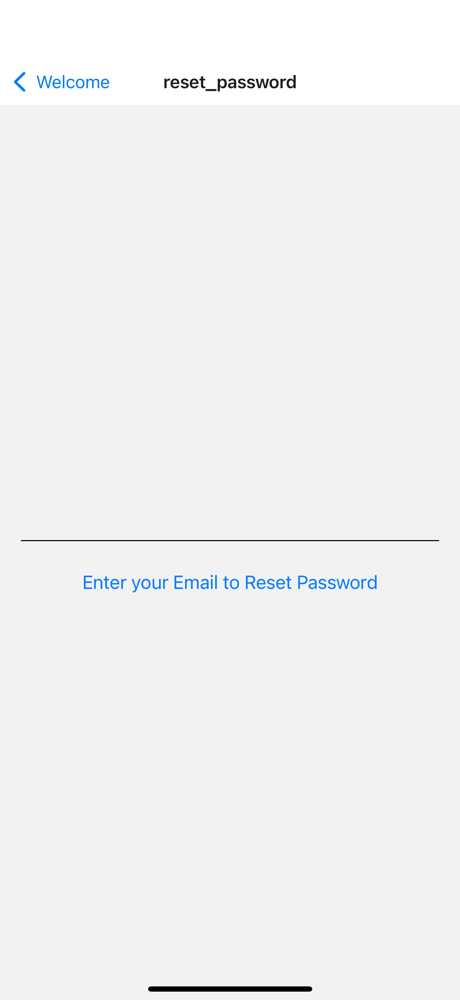

### Sign Up
After clicking 'Sign Up', you will be prompted to enter an email, and a password. 

Enter an email and password, then press 'Sign Up'

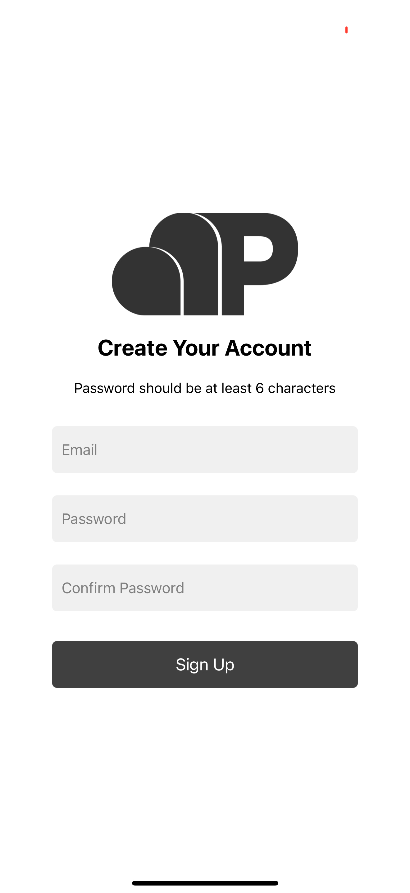

### Sign In
After creating an account, you will be navigated to the 'sign in' page to sign into your newly created account. 

Enter your credenitals to sign into your account, then press 'Sign In'

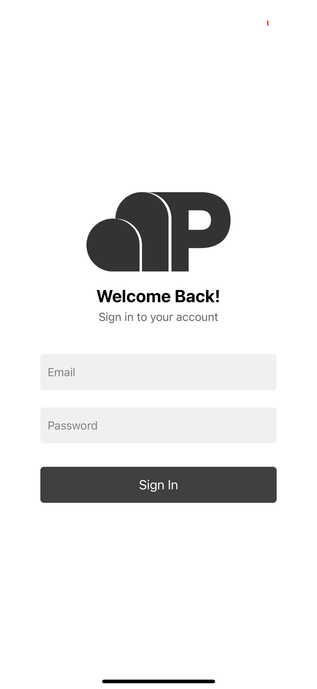

### Main Menu 
After signing in with your credentials, you will be navigated to the 'main menu' page where you will be presented with a list of options including adding a property, adding a project, adding an invoice, seeing your property summary, seeing your contractor(s)' info, and seeing the community property summaries. Begin by pressing the 'Add a New Property' page.
   
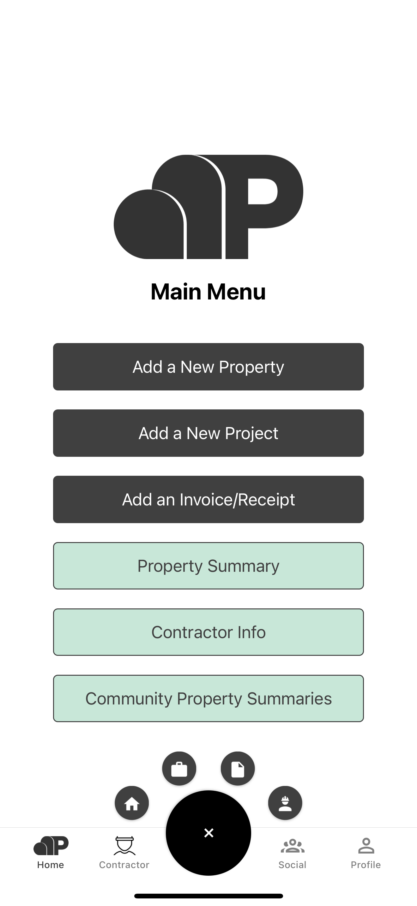

### Property Management  
You will see fields that you will need to enter, including street name, city, state, and zip code for your properties. After filling these values in, you will be able to add your property by pressing the 'Add Property' button, after which you will see a success message and will see your property displayed on the page. 

Press 'Add a New Property' page
Fill in 'Street', 'City', 'State', and 'Zip Code' values, choose whether you want the property to be private or not, and select 'Add Property'.

Private properties will not show up under the Community Property Summaries page.
   
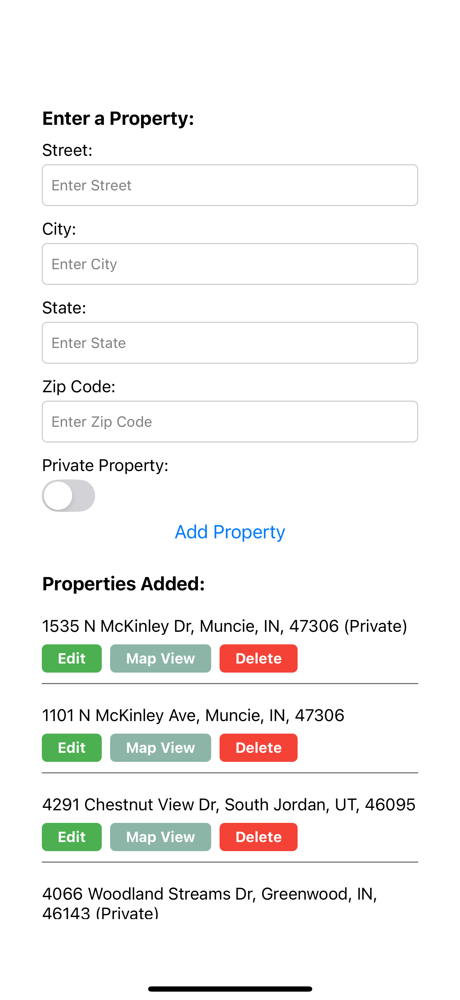

To view the location of a property on the map, press the "Map View" button. Something like this should appear:

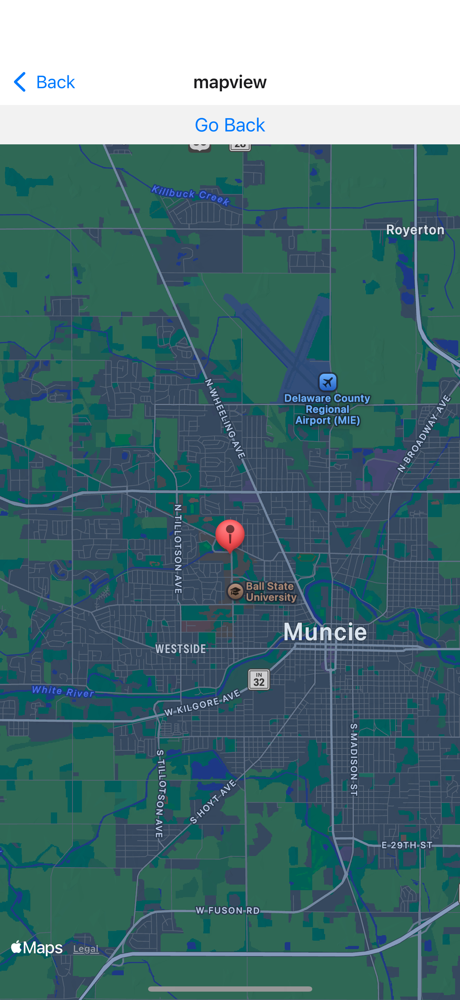

### Project Management  
On the projects page, you'll see a list of every project on your profile and the property they belong to.

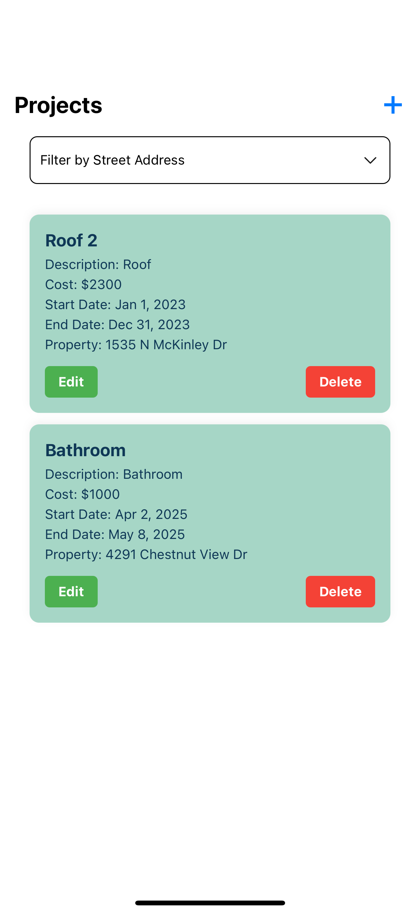

To add a project, press the plus button in the top right corner, 
   
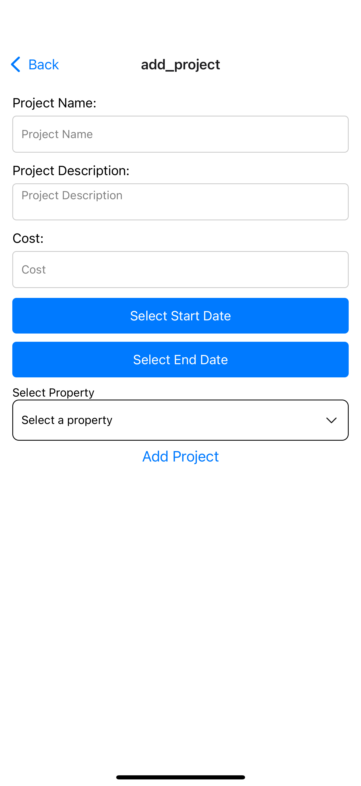

You can also edit and delete projects by selecting their corresponding buttons on the projects page.

### Document Management  
On the documents page, you'll see a list of every document under your profile and the projects they're attached to. 

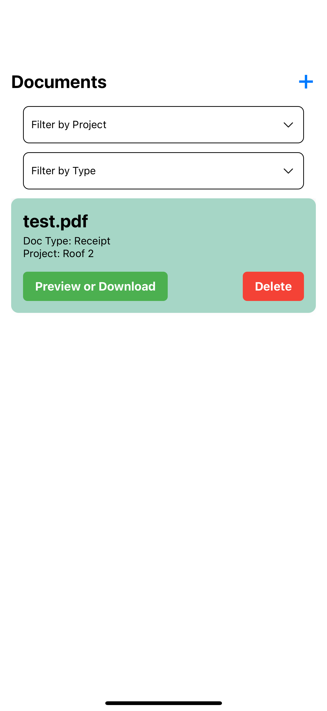

To add a new document, press the plus button in the top right corner, select the type of file and the project to attach it to. 
   
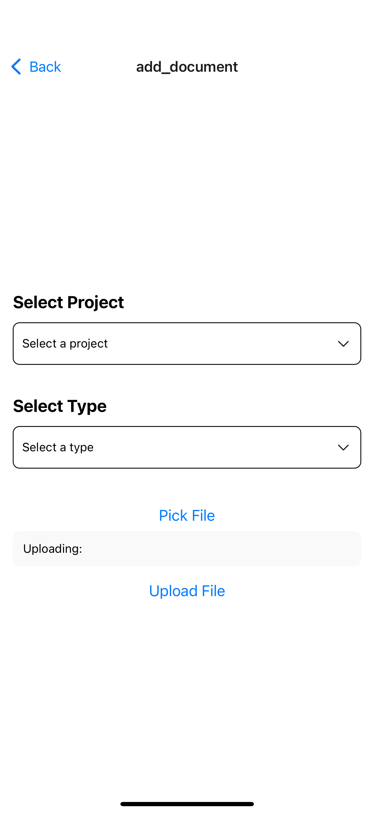

You can also download the document by pressing the respective button on the page, or delete them by doing the same.

### Property Summary  
The property summary page will allow you to see a summary of all your properties, and associated projects and documents. You can generate a summary of all the projects and documents on the property by pressing "Generate PDF Summary".

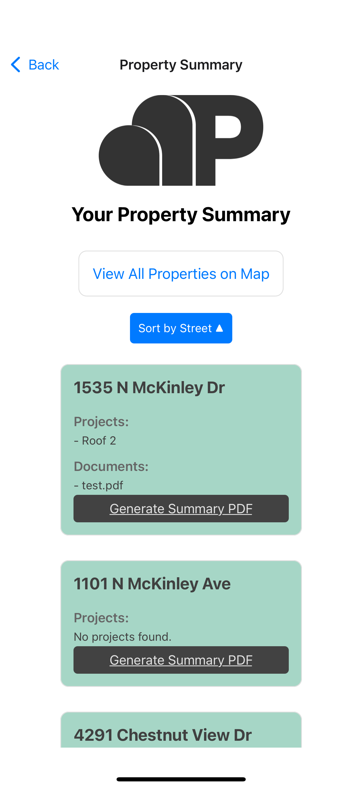

Press "View All Properties on Map" to view every property on the map, like this:

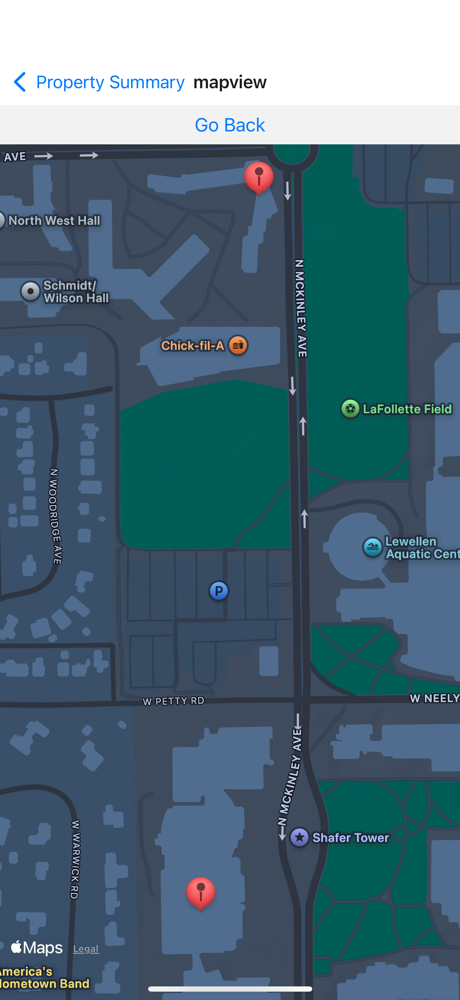

### Community Property Summary  
The community property summaries page will allow you to see a summary of all the properties, and associated projects and documents of all the members of the placenet app.  
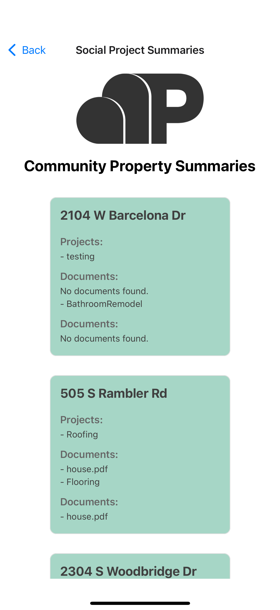

### Contractors
The contractors page allows you to manage the info of contractors that have done work on your property, just go to the page, enter info, then press "Add Contractor" to add info. You can also edit or delete contractor info as well. 

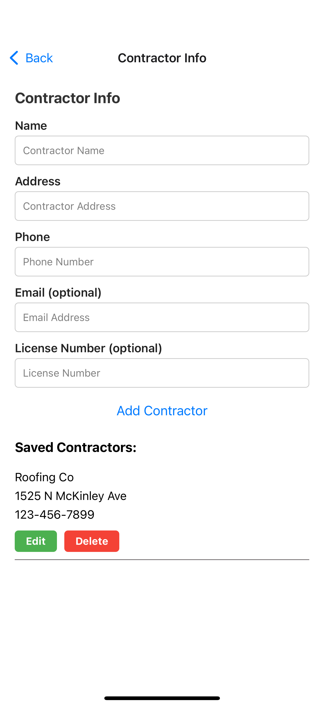
