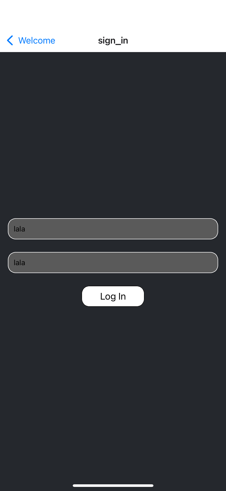
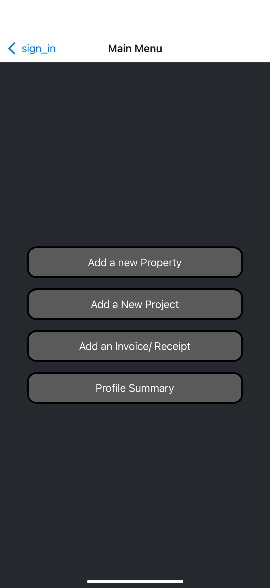
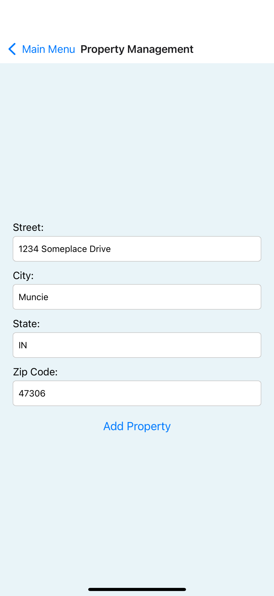
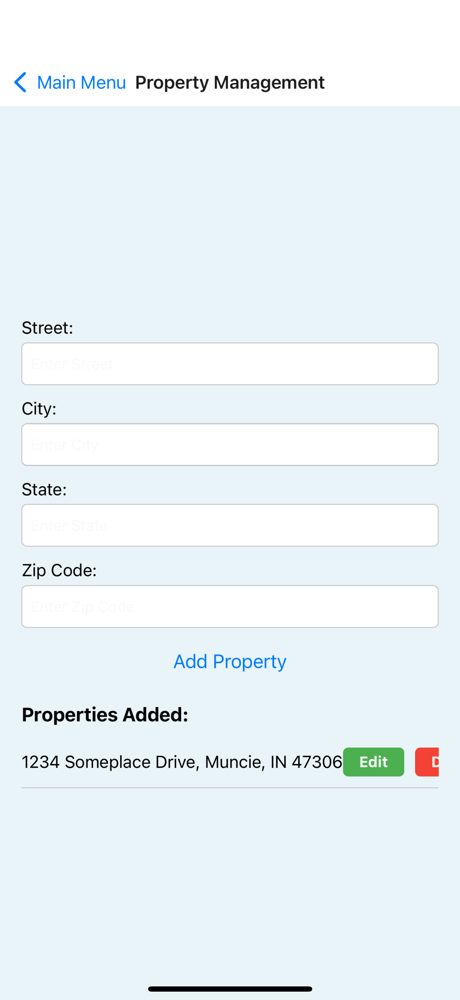
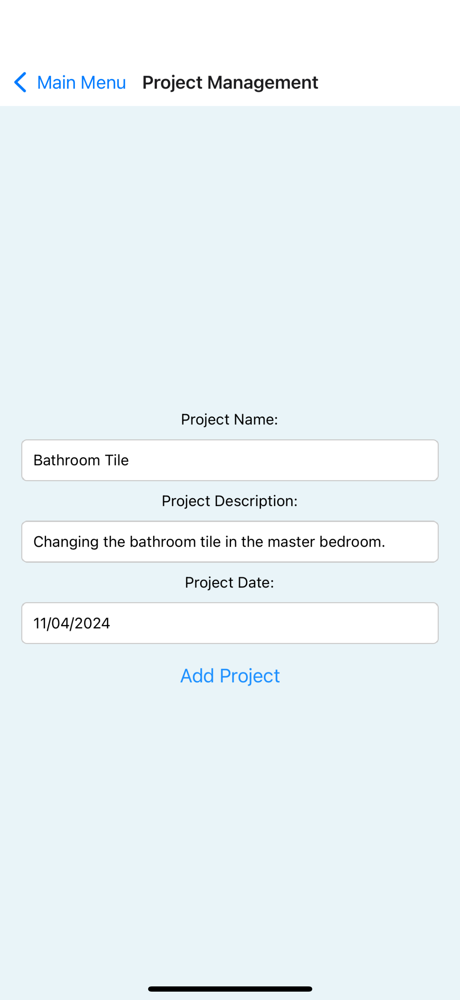

# How to use the Placenet App (Iteration 1)

### Accessing and Signing In

1. Press "Click to Enter"

2. Enter your username and password, then press "Log In"

The main menu should look like this:

### Property Management

1. Press the "Add a new Property" button after signing in.

2. If no properties have been added, simply enter the address of the property in the proper fields as shown, then press "Add Property".

3. To edit a property, press the edit button next to the property and change the info as needed, then press "Update Property".

4. To delete a property, press the red button next to the address.

### Project Management

1. Press the "Add a New Project" button after signing in.

2. Enter the name of the project, a brief description, and the date of the project in the respective fields. Then press "Add Project". 

**It is heavily advised to note the address of the property the project is for in the description for this iteration.**

3. To edit a project, press the "Edit" button right below the project you wish to edit.

4. To delete a project, press the "delete" button beneath the project you wish to delete.

### Document Management

1. Press "Add an Invoice/Receipt" after signing in.

2. Press "upload your file", then select the document you wish to upload.

3. To remove a document, simply press the "Remove" button below the name of the document.

