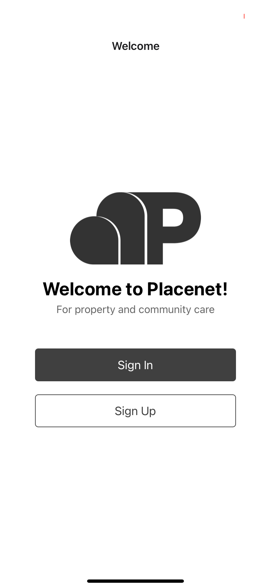
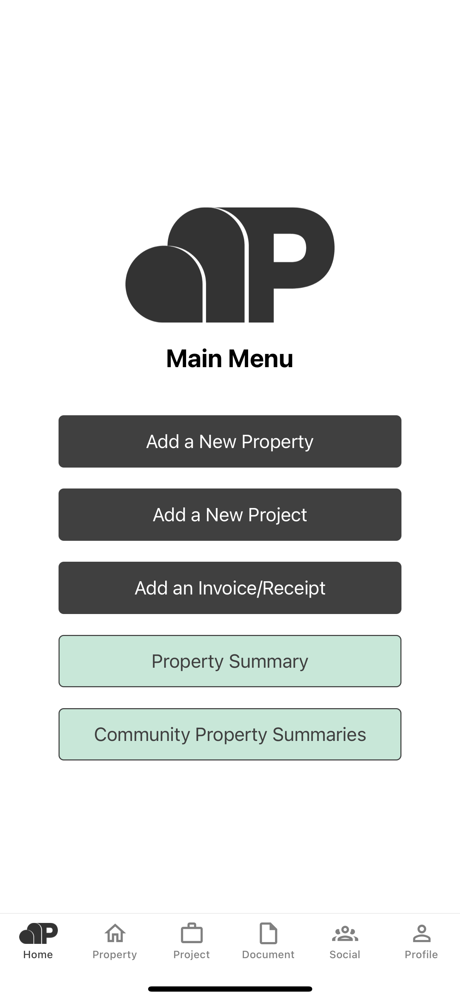
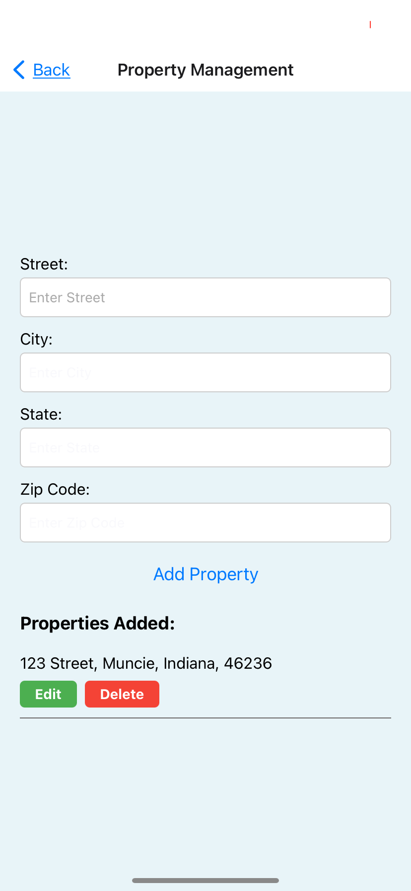
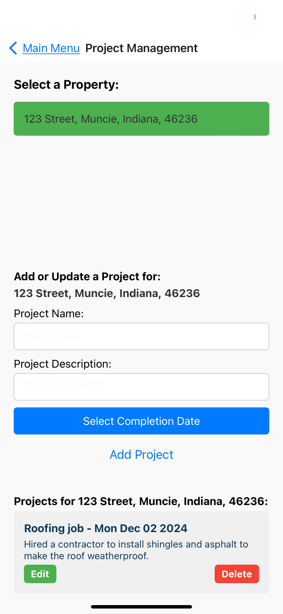
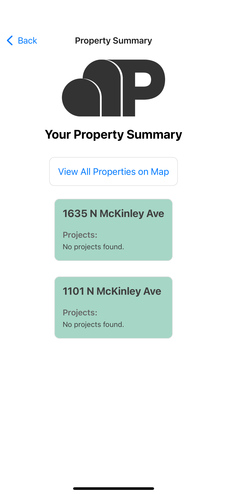
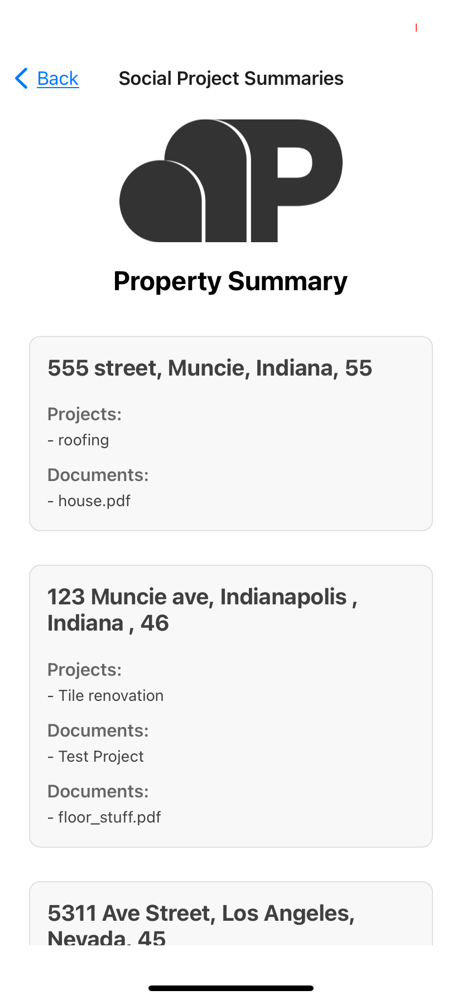

# How to use the Placenet App (Iteration 4)

### Welcome Page
When you first access the app, you will see the welcome page where you will be prompted to sign into your existing account, or create an account by signing up.
1.  Click 'Sign Up'

### Sign Up
After clicking 'Sign Up', you will be prompted to enter a username, and a password. 

2. Enter a username and password, then press 'Sign Up'

### Sign In
After creating an account, you will be navigated to the 'sign in' page to sign into your newly created account. 

3. Enter your credenitals to sign into your account, then press 'Sign In'

### Main Menu 
After signing in with your credentials, you will be navigated to the 'main menu' page where you will be presented with a list of options including adding a property, adding a project, adding an invoice, seeing your property summary, and seeing the community property summaries. Begin by pressing the 'Add a New Property' page.

4. Press 'Add a New Property' page
   

### Property Management  
You will see fields that you will need to enter, including street name, city, state, and zip code for your properties. After filling these values in, you will be able to add your property by pressing the 'Add Property' button, after which you will see a success message and will see your property displayed on the page. 

5. Fill in 'Street', 'City', 'State', and 'Zip Code' values and select 'Add Property'
   

To view the location of a property on the map, press the "Map View" button. Something like this should appear:

### Project Management  
You select the property you wish to add a project to. A project is any work done to your property, which could include renovations, repairs, upgrades, etc. You will then be prompted to enter fields including the name of your project, a description for your project, and the date in which your project was completed. You will then be able to add your project by selecting 'Add Project'. You will see your project displayed on the screen and will be given the option to edit or delete your project. 

6. Select a property for your project, and enter 'Project Name', 'Project Description', and select a 'Completion Date', then select 'Add Project'.
   

### Document Management  
Similarly to project managment, you select the project you wish to add a document to. A document will be a PDF file that could include invoices, recepts, etc to demonstrate the work done to your property. You will be prompted to upload a PDF file from your device and you will see it displayed in the page. You will be given the option to download this file again, which downloads your file from a web browser, or delete this file.  

7. Select a project for your document, and upload a pdf file.
   

### Property Summary  
The property summary page will allow you to see a summary of all your properties, and associated projects and documents.    

Press "View All Properties on Map" to view every property on the map, like this:

### Community Property Summary  
The community property summaries page will allow you to see a summary of all the properties, and associated projects and documents of all the members of the placenet app.  

