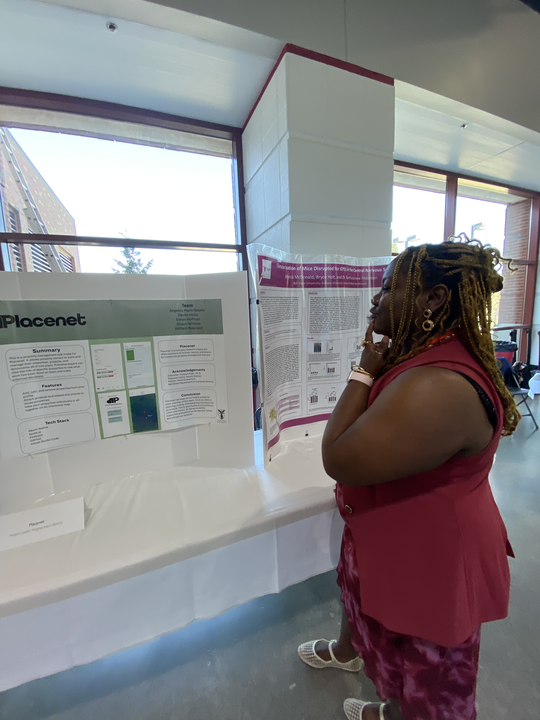
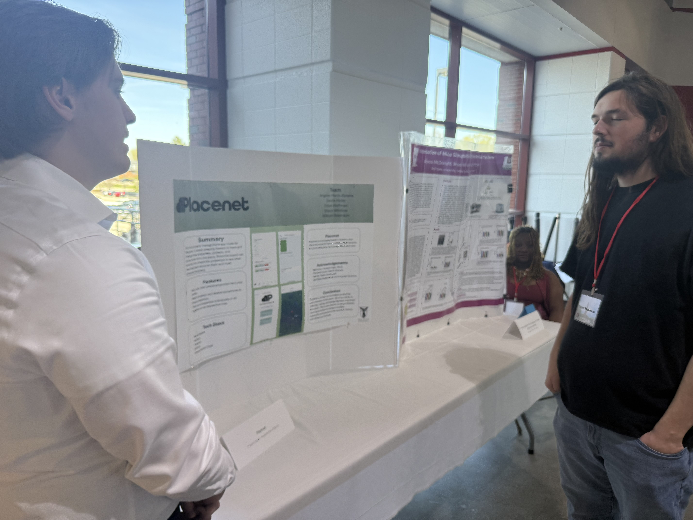
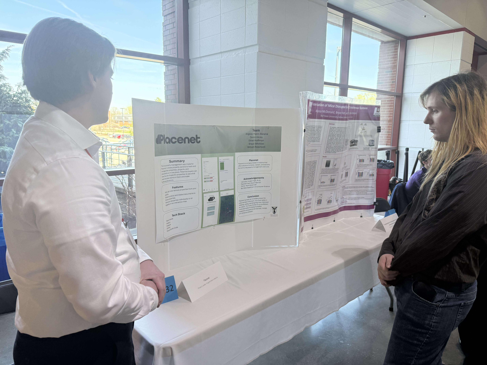
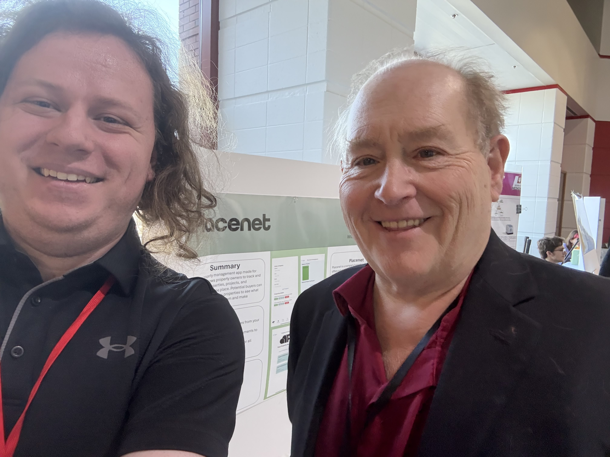
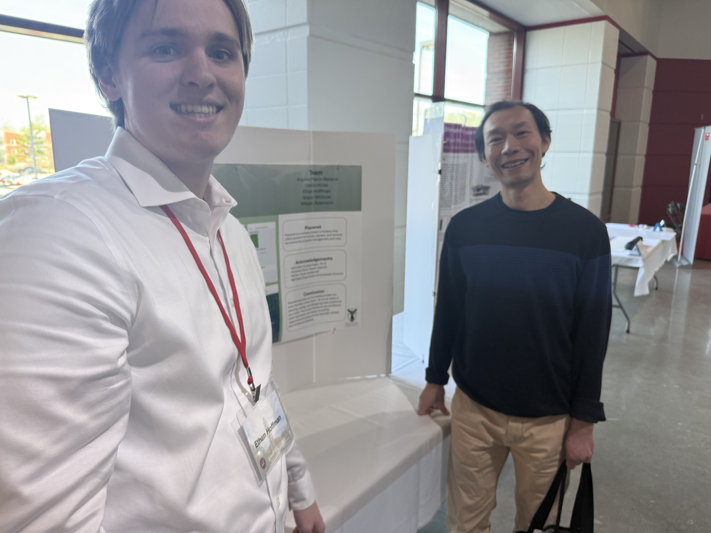
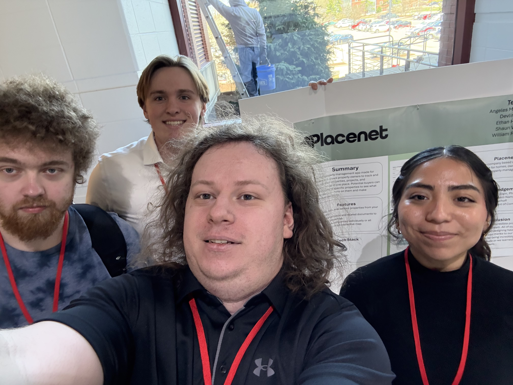

# Project Viewers

- Alyssa Mcdonald
    
    

- Tanner Bauserman

    

- Kc Weaver

    

- Dr. Ramo Lord

    

- Henry

    

# Our Experiences
- **Angeles Marin-Batana**: It was a cool expereince being able to oberserve the capstone projects of other people and get to share your own. It was cool to have other people teach you about their area of study and then be able to teach them something they didn't know about as well. Overall it was a really good expereince. 

- **Devlin Hicks**: At the Symposium, I was interested in the projects and work done by the other students. Though, that is not the only reason I was there. I had some time to present the project and I decided to do it to contribute at least some work and take the load off of the others at least temporarily.  Overall, I think I did a good job explaining the project to people who passed on by. I gave a rundown of the features

- **Ethan Hoffman**: The student symposium was a good chance to see how our project compared to everyone else that had done creative work for the year. It was very impactful talking to people about their thoughts and opinions of the app that we were making. One person in particular, Henry, was very interested in the whole process of how our class was structured and was very curious about our app. We eventually got on the topic of game design which was a fun switch from what was discussed previously. Overall, the student symposium was a great time to show off the work we have been doing for the past two semesters.

- **William Robinson**: It was incredibly awesome and interesting to see how much interest there was in our project as well as the other projects at the Symposium. I got to talk to a lot of interesting people about not just the project, but other related topics as well. It surprised me just how interested so many other people from various different majors and backgrounds were for the other projects outside of their own field of knowing.

# Team Picture

